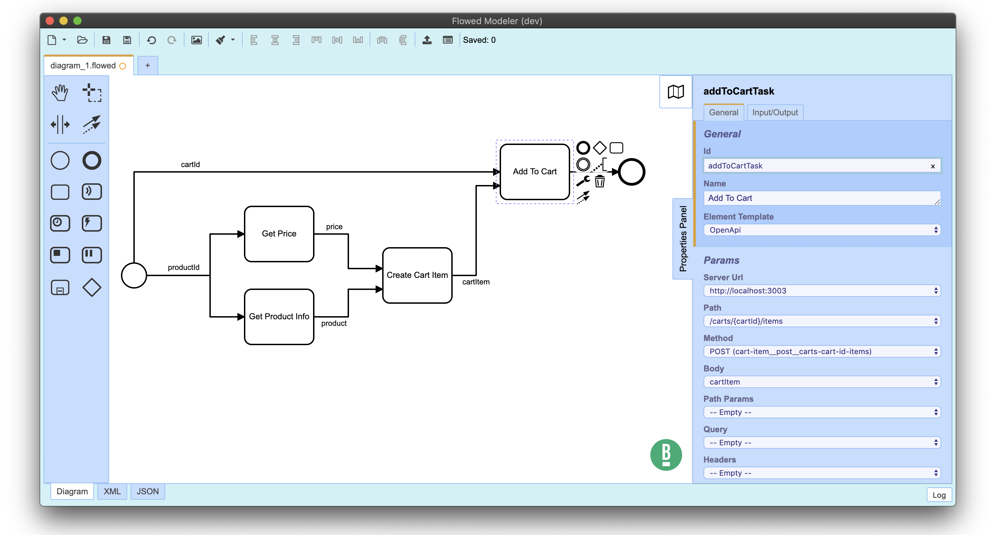

# Flowed Modeler

A modeling solution for [Flowed](https://danielduarte.github.io/flowed).



Based on [Camunda Modeler](https://camunda.com/products/modeler/) and [bpmn.io](http://bpmn.io).

## Features

* Design flows with a visual easy-to-use UI
* Open/save flows from/to files
* Deploy flows to a Flowed server
* OpenApi integration and autocompletion


## Resources

* [Changelog](#) (coming soon)
* [Download](#) (coming soon)
* [Give Feedback](#) (coming soon)
* [Report a Bug](https://github.com/danielduarte/flowed-modeler/issues)
* [User Documentation](https://github.com/danielduarte/flowed-modeler/blob/flowed_develop/README.md)


## Building the Application

```sh
# checkout a branch
git checkout flowed_develop

# install dependencies
npm install

# execute all checks (lint, test and build)
npm run all

# build the application to ./dist
npm run build
```


### Development Setup

Spin up the application for development, all strings attached:

```
npm run dev
```


## License

MIT

Uses [bpmn-js](https://github.com/bpmn-io/bpmn-js), [dmn-js](https://github.com/bpmn-io/dmn-js), and [cmmn-js](https://github.com/bpmn-io/cmmn-js), licensed under the [bpmn.io license](http://bpmn.io/license).

Uses [camunda-modeler](https://github.com/camunda/camunda-modeler), licensed under the [MIT license](https://github.com/camunda/camunda-modeler/blob/develop/LICENSE).
